# CS429 Project: Document Search Application

## Abstract
The Document Search Application is a tool with the goal to search through HTML documents. The application employs TF-IDF (Term Frequency-Inverse Document Frequency) for term importance evaluation and Word2Vec for semantic analysis. 

## Overview
Our Flask-based web application offers users the ability to search through a corpus of HTML documents by analyzing the content using state-of-the-art natural language processing techniques. The system harnesses TF-IDF to measure word significance and utilizes Word2Vec to grasp the semantic relationships between words within the corpus. The next phase includes the advancement of phrase recognition and context understanding through potential incorporation of sophisticated models such as Doc2Vec.

## Design
The Document Search Application provides a user-friendly web interface for query submission and results display. The backend leverages TF-IDF to construct a matrix representing term importance and employs Word2Vec to capture semantic word relationships. This dual-model approach aims to deliver precise and contextually relevant search results.

## Architecture
The application's architecture encompasses the following components:
- **Flask Web Server**: Manages user requests and delivers the web interface for the search system.
- **TF-IDF Vectorizer**: Converts documents into a matrix to gauge term significance within the corpus.
- **Word2Vec**: Creates word embeddings to understand semantic similarities.
- **Joblib**: Efficiently saves and loads the machine learning models.

## Operation
### Installation and Setup
To install the required dependencies, run the following commands:
```bash
pip install Flask numpy gensim nltk scikit-learn beautifulsoup4 scrapy
```

### Running the Application
1. Clone the repository to a local directory.
2. Navigate to the `[FLASK] main` directory. This is where the main Flask application files are located. 
3. Execute `app.py` to start the Flask web server:
```bash
python app.py
```
3. Open a web browser and navigate to `http://127.0.0.1:5000` to access the search interface.
4. Enter search queries to retrieve relevant documents based on the content.
   
Alternatively, you can run the script:
```bash
./RunMe
```

## Test Cases
The application has undergone rigorous testing with a variety of queries to ensure the accuracy and relevance of the search results. Tests include single-word and multi-word queries, assessing the efficacy of both the TF-IDF and Word2Vec models.

### Sample Queries

To demonstrate the capabilities of the Document Search Application, the following queries are designed to test various aspects of the search system's performance. Each query is chosen to reflect the system's ability to handle diverse topics and content types:

1. **Query**: "Global warming impacts"  
   **Why**: Tests the application's ability to fetch documents on environmental science and the current global issue of climate change.

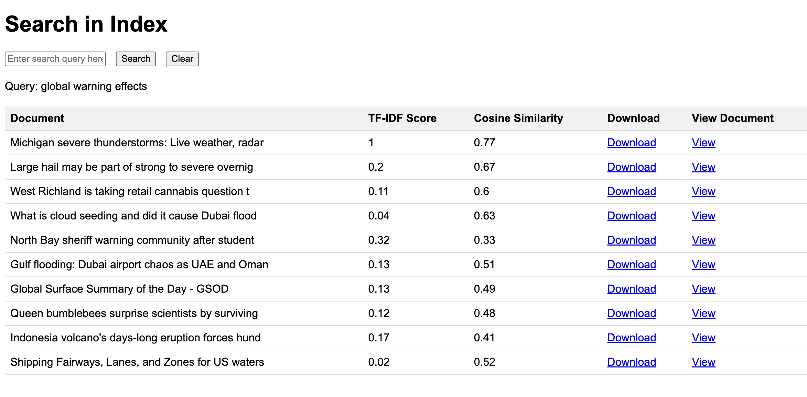

2. **Query**: "Technology"  
   **Why**: Evaluates the system's effectiveness in returning current and emerging technological topics.

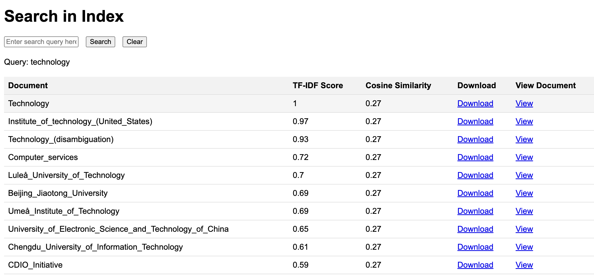

3. **Query**: "Renaissance art movements"  
   **Why**: Assesses the system's performance in retrieving historical content, focusing on art history.

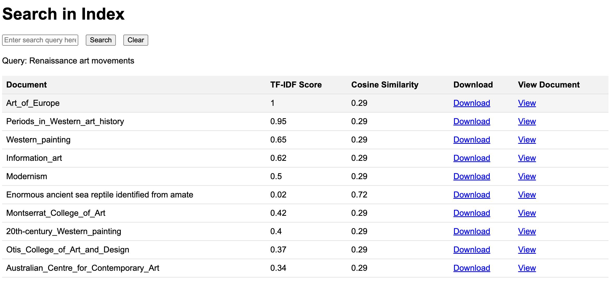

4. **Query**: "Python programming tips"  
   **Why**: Chosen to test the retrieval of educational content related to technology and programming.

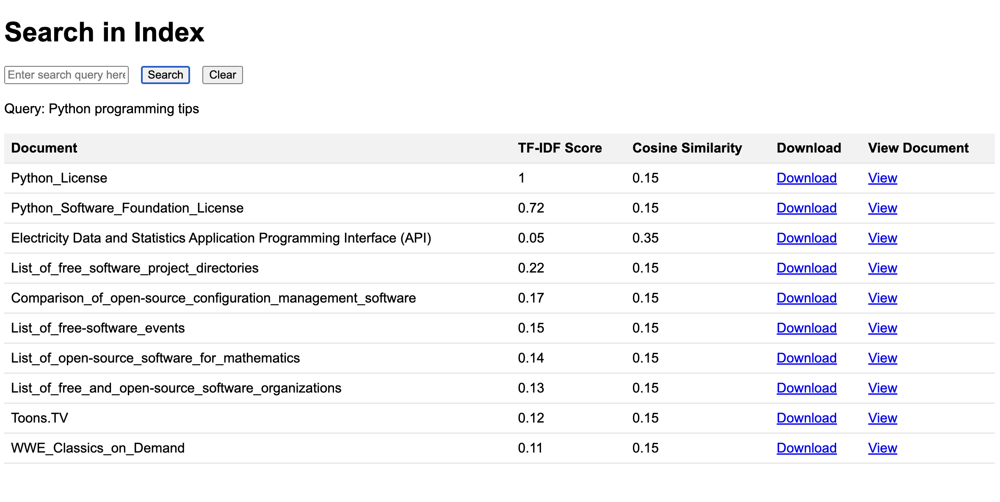

5. **Query**: "COVID-19 pandemic response"  
   **Why**: Selected to evaluate the system's response to queries about significant ongoing global health crises.

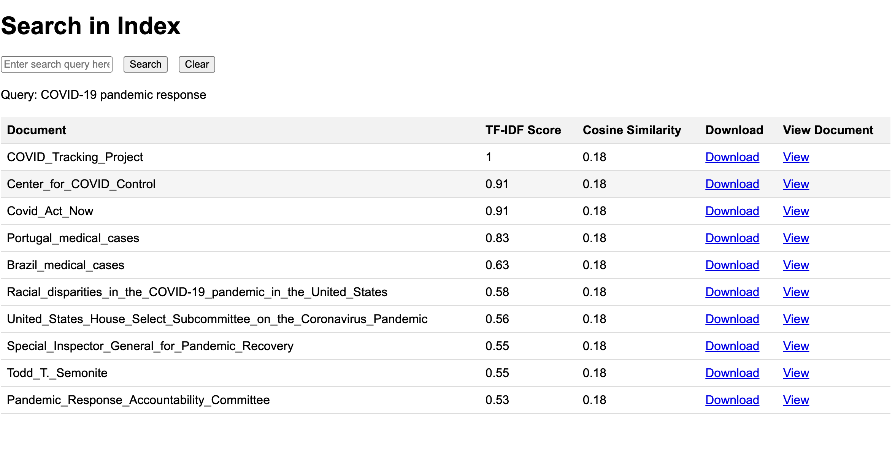

6. **Query**: "Apple"  
   **Why**: Tests how well the system retrieves information related to a famous technology company.

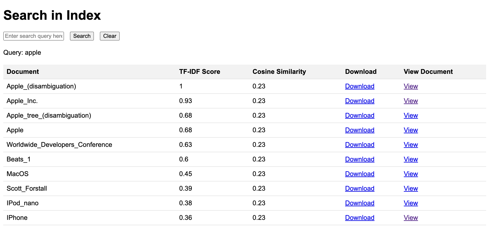

7. **Query**: "Quantum computing applications"  
   **Why**: Assesses the system's ability to handle content about advanced scientific topics and their applications.

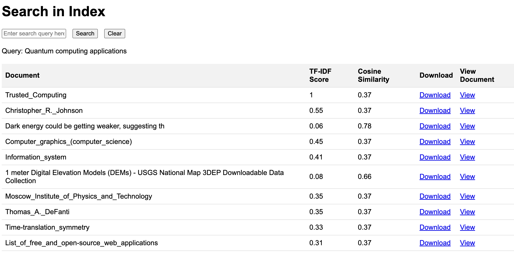

8. **Query**: "Mars rover missions"  
   **Why**: Chosen to test the system’s ability to provide specific content related to space exploration.

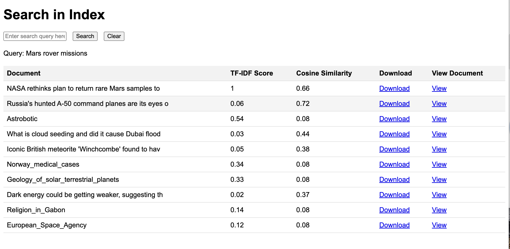

9. **Query**: "Economic impact of COVID-19"  
   **Why**: Tests the system's ability to handle interdisciplinary content bridging health and economic domains.

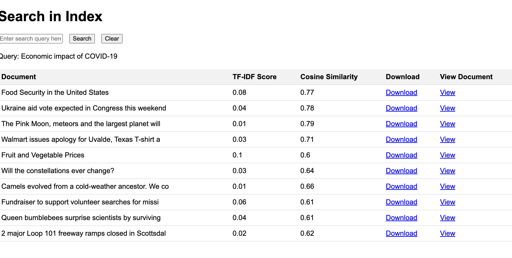

10. **Query**: "Advancements in renewable energy"  
    **Why**: Evaluates how well the system retrieves documents about sustainable technologies and environmental initiatives.
    
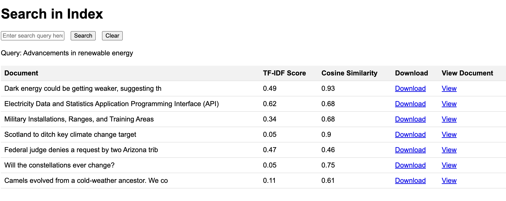


10. **Query**: "ERROR: apsockasc"  
    **Why**: Evaluates how the system handles invalid queries.
    
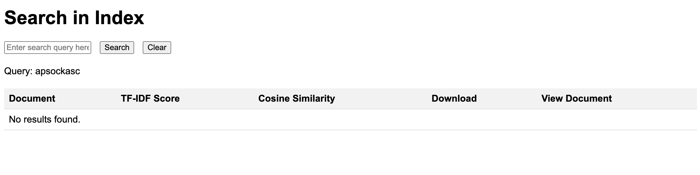


## Conclusion
The application has demonstrated the ability to facilitate effective document retrieval based on content similarity. The integration of TF-IDF and Word2Vec has shown to significantly enhance the relevance of the search results. The inclusion of Scrapy for document collection provides a substantial corpus for more nuanced search functionalities..

## Data Sources
The application conducts searches on a locally hosted corpus of HTML files stored within the `./[FLASK] main/docs` directory. All the files within docs where retrieved using Scrappy, with 3 different spiders. The target URL where wikipedia, newspapers, and The Gutenberg project.

## Source Code

The source code for the Document Search Application is structured as follows:

- `PROJ/`
  - `[DATA] testing/`: Contains data used for testing purposes.
  - `[FLASK] main/`: The main directory for the Flask application.
    - `docs/`: Contains the HTML documents that the application will search through.
    - `templates/`: Holds the HTML templates used by Flask to render the search interface.
      - `index.html`: The main HTML file for the search interface.
    - `app.py`: The core Flask application script that runs the web server and search functionality.
  - `CRAWLING_main/`: Contains the components for web crawling and scraping.
    - `spiders/`: Directory for Scrapy spiders.
      - `catalog_gov_spider.py`: A Scrapy spider for crawling government catalog websites.
      - `news_spider.py`: A Scrapy spider for crawling news websites.
      - `wiki_spider.py`: A Scrapy spider specifically for crawling Wikipedia pages.
      - `items.py`: Defines the Scrapy Item classes.
      - `middlewares.py`: Contains middleware components for Scrapy.
      - `pipelines.py`: Defines Scrapy pipelines for post-processing scraped data.
      - `settings.py`: Configuration settings for Scrapy.
    - `scrapy.cfg`: The main configuration file for Scrapy.
  - `index_creator.py`: Script for creating the search index from the scraped HTML documents.
  - `inv_index.pkl`: The pickled inverted index file generated by `index_creator.py`.
  - `model.bin`: The binary file representing the Word2Vec model.
  - `README.md`: The markdown file providing documentation for the project.
  - `word2vec_gen.py`: Script for generating the Word2Vec model from documents.
  - `word2vec_model.pkl`: The pickled Word2Vec model generated by `word2vec_gen.py`.


### Dependencies
The application utilizes several open-source libraries, listed as follows:
- **Flask**: A micro web framework for Python.
- **NumPy**: A library for large, multi-dimensional arrays and matrices.
- **Gensim**: An open-source library for unsupervised topic modeling and natural language processing.
- **NLTK (Natural Language Toolkit)**: A suite of libraries and programs for symbolic and statistical natural language processing.
- **Scikit-Learn**: A machine learning library for Python.
- **BeautifulSoup4**: A library that makes it easy to scrape information from web pages.

## Bibliography
Please reference the following sources for more information on the technologies and methodologies used in this project:
1. McKinney, Wes. "Data Structures for Statistical Computing in Python." *Proceedings of the 9th Python in Science Conference.* 445 (2010): 51-56.
2. Bird, Steven, Edward Loper, and Ewan Klein. "Natural Language Processing with Python." O'Reilly Media Inc., 2009.
3. Rehurek, Radim, and Petr Sojka. "Software Framework for Topic Modeling with Large Corpora." *Proceedings of the LREC 2010 Workshop on New Challenges for NLP Frameworks.* (2010).
4. "Flask Documentation." Pallets Projects. [Flask Documentation](https://flask.palletsprojects.com/en/1.1.x/)
5. Pedregosa, F. et al. "Scikit-learn: Machine Learning in Python." *Journal of Machine Learning Research* 12 (2011): 2825-2830.
6. "Scrapy 2.4 Documentation." Scrapy. [Scrapy Documentation](https://docs.scrapy.org/en/latest/)
7. "Beautiful Soup Documentation." Crummy. [Beautiful Soup 4.9.0 Documentation](https://www.crummy.com/software/BeautifulSoup/bs4/doc/)
   

Special thanks to ChatGPT for project assistance and guidance. A nod of gratitude to YouTube Channels: freecodecamp.org and Krish Naik for their Flask tutorials which have significantly contributed to the learning process. This project wouldn't be what it is without the collective wisdom shared by the open-source community.

